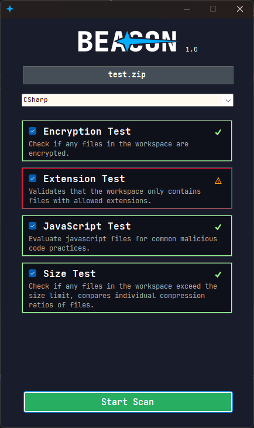

    
    Proof-of-concept submitted zip archive scanner, which tests for common attack vectors. (lil uni assignment)

Beacon defines tests for common attack vectors such as:
- unexpected file types in defined workspace types (arbitrary binary files in a javascript workspace)
- large uncompressed file sizes (tested against guesstimated compression ratios)
- straight-forward javascript code analysis, which checks for common obfuscation techniques, malformed code and potentially unsafe functions.
- simple checks for file encryption.

These tests can be expanded upon by "plugins" (through the waypoint library), which Beacon loads and registers at runtime, plugin-based tests have equivalent capabilities to the built-in tests, wherein they can pass a result boolean and a string array of warnings to display.

Tests are provided with a simple workspace context object, which can be used to navigate through the zip file entries, and workspace type, additionally individual fields can specify which workspace type they apply to, which can then be computed in the test itself.